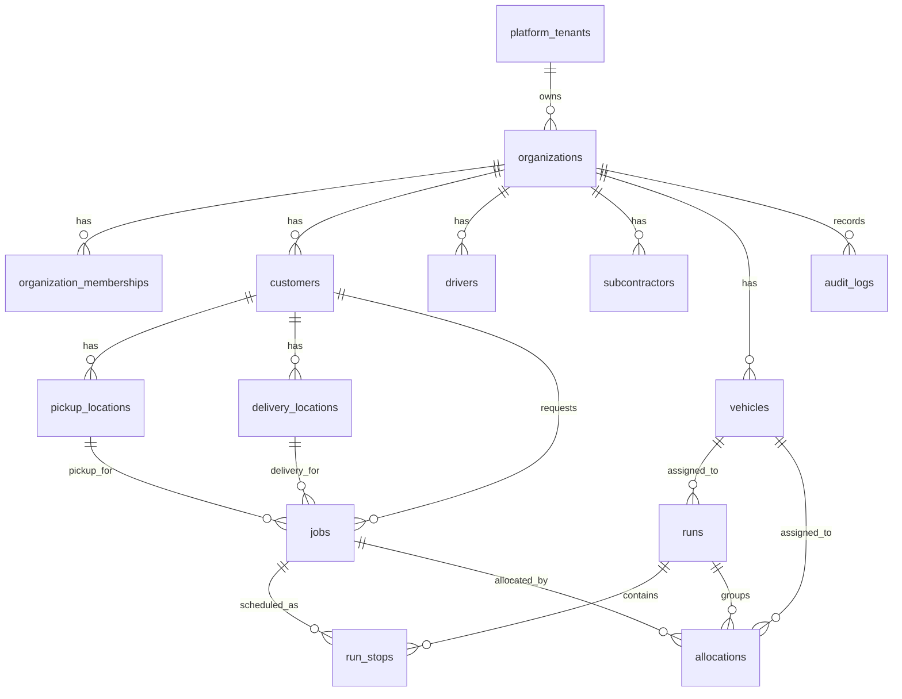

# FleetOS Database

FleetOS V1 uses one shared Supabase project with organization-based multi-tenancy. Tenant-owned operational tables carry both `tenant_id` and `organization_id`, use strict Row Level Security, and rely on application-level RBAC for role and permission decisions.

## Local Reset From Zero

Prerequisites:

- Docker Desktop running
- Supabase CLI installed

From a clean checkout:

```bash
corepack pnpm install
supabase db reset
```

The reset applies every file in `supabase/migrations` and then runs `supabase/seed.sql`. The seed creates `admin@fleetos.local` for fresh local resets when the Auth user does not already exist.

If you are using a hosted Supabase project instead of the local CLI stack, apply migrations in timestamp order, create or confirm `admin@fleetos.local` in Auth, then run `supabase/seed.sql` in the SQL Editor.

## Core Tables

Platform and tenancy:

- `platform_tenants` is the top-level tenant record.
- `organizations` is the V1 tenant boundary used by the app.
- `organization_memberships` connects Supabase Auth users to organizations and role keys.
- `platform_super_admins` grants FleetOS internal access outside normal organization RBAC.

Auth and RBAC:

- `roles`, `permissions`, and `role_permissions` define default V1 permissions.
- Organization access is resolved from `organization_memberships`.
- Platform super admin access is resolved only from `platform_super_admins`.

Operations foundation:

- `drivers` stores driver profile records linked to Auth users when available.
- `subcontractors` stores subcontractor company records.
- `vehicles` stores fleet assets.
- `customers`, `pickup_locations`, and `delivery_locations` store customer-facing references.
- `jobs` stores transport job records.
- `runs` stores planned or active run records.
- `run_stops` stores ordered multi-stop run details.
- `allocations` connects jobs, runs, vehicles, and assigned operators.
- `status_history` records status transitions.
- `audit_logs` records security-sensitive and operational actions.

## Relationship Map



## Integrity Rules

Every tenant-owned operational table includes `tenant_id` and `organization_id`.

Composite foreign keys enforce that child records point to rows from the same tenant and organization. For example:

- A job's customer and locations must belong to the same tenant and organization as the job.
- A run's vehicle must belong to the same tenant and organization as the run.
- A run stop's run and optional job must belong to the same tenant and organization as the stop.
- An allocation's job, run, vehicle, and subcontractor membership must belong to the same tenant and organization as the allocation.

This prevents valid UUIDs from accidentally linking records across organizations.

## RLS Model

Row Level Security is enabled on all tenant-owned tables. Tenant members can access rows only when `public.is_tenant_member(tenant_id)` is true for the authenticated user.

Platform super admin tables are separate from organization roles. Super admin routes must use server-side checks against `platform_super_admins`; normal organization roles never grant super admin access.

## Indexing

Core tables have indexes for the common access paths:

- `tenant_id`
- `organization_id`
- user references such as `user_id`, `driver_user_id`, and `actor_user_id`
- foreign key references such as `customer_id`, `job_id`, `run_id`, `vehicle_id`, and `subcontractor_id`
- status and operational sorting fields

Composite unique indexes support tenant-safe foreign keys and idempotent local seed runs.

## Seed Data

`supabase/seed.sql` is idempotent and uses real IDs resolved during execution:

- It looks up the existing Supabase Auth user `admin@fleetos.local`, or creates it for a fresh local reset.
- It creates Jindal Transport as the demo tenant and organization.
- It creates default roles and permissions.
- It creates the owner membership and platform super admin access for the Auth user.
- It creates sample customer, driver, subcontractor, vehicles, jobs, runs, stops, allocations, status history, and an audit log.

The local reset password for the seeded Auth user is `Password123!`. Use your own password if you create the Auth user manually before running the seed.

## Migration Order

Migrations are timestamped and must run in order:

1. `202605090001_database_foundation.sql`
2. `202605090002_auth_rbac_foundation.sql`
3. `202605090003_jobs_runs_foundation.sql`
4. `202605090004_milestone1_platform_foundation.sql`
5. `202605090005_access_vehicles_control_tower.sql`
6. `202605090006_database_stabilization.sql`

The stabilization migration adds missing core driver and subcontractor tables, vehicle foreign keys, tenant-safe composite foreign keys, and supporting indexes.
