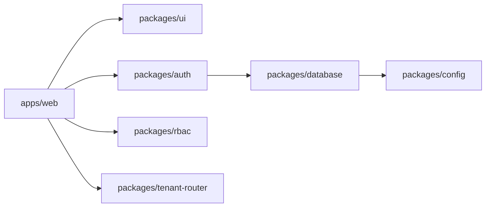

# FleetOS Architecture

FleetOS is structured as an enterprise SaaS monorepo with a small set of explicit boundaries. The foundation is intentionally minimal so product features can be added without coupling application code to infrastructure details.

## Monorepo Layout

- `apps/web` contains the Next.js application shell.
- `packages/database` owns Supabase client creation and database-facing types.
- `packages/auth` owns authentication contracts and session types.
- `packages/rbac` owns roles, permissions, and authorization contracts.
- `packages/tenant-router` owns tenant resolution contracts.
- `packages/ui` owns shared React UI primitives.
- `packages/config` owns shared TypeScript configuration and environment helpers.
- `supabase/migrations` contains database schema migrations.
- `supabase/functions` contains Supabase Edge Functions.

## Dependency Direction

Applications may depend on packages. Packages should stay focused and avoid depending on application code.

## SaaS Boundaries

Tenant routing, authentication, authorization, and database access are separate package boundaries. This keeps future multi-tenant behavior testable and prevents feature code from reaching directly into unrelated concerns.

## Supabase

Supabase migrations live in `supabase/migrations`. Edge Functions live in `supabase/functions`. The foundation does not create product tables yet; schema changes should be introduced feature by feature through migrations.
